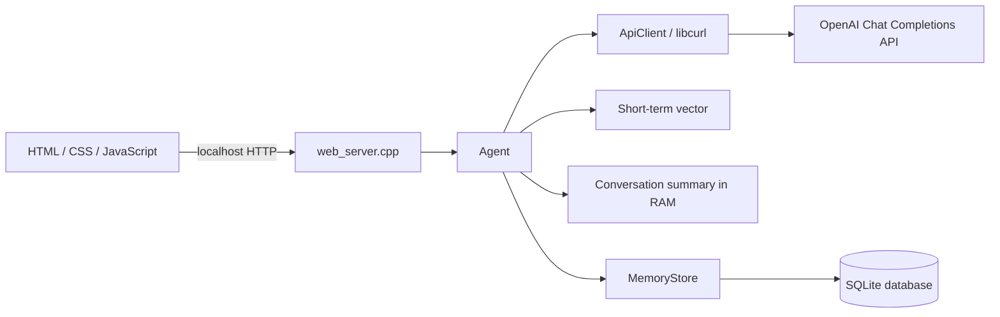

# C++ LLM Agent

Локальное веб-приложение с агентом на C++17. Браузер отвечает только за интерфейс, а работа с OpenAI API, policies, контекстом и памятью выполняется в C++.

Сервер доступен только локально по адресу `http://127.0.0.1:8080`.

## Возможности

- полноценный чат с контекстом предыдущих сообщений;
- input policy и обязательная проверка ответа через output policy;
- short-term memory в `std::vector`;
- сжатие старой истории в отдельный conversation summary;
- включение и выключение compression кнопкой на сайте;
- long-term memory в SQLite;
- накопительная статистика токенов, включая отдельные расходы summarizer;
- API-ключ только в переменной окружения `OPENAI_API_KEY`.

## Архитектура



| Файл | Ответственность |
| --- | --- |
| `main.cpp` | Создаёт `Agent` и запускает веб-сервер |
| `agent.h`, `agent.cpp` | Контекст, policies, short-term memory, summary, long-term extractor и статистика |
| `api_client.h`, `api_client.cpp` | HTTPS-запросы к OpenAI через libcurl и разбор ответа API |
| `memory_store.h`, `memory_store.cpp` | Чтение и обновление long-term facts в SQLite |
| `web_server.h`, `web_server.cpp` | Локальный WinSock HTTP-сервер и маршруты `/api/*` |
| `index.html`, `styles.css`, `app.js` | Веб-интерфейс чата |

## Обработка одного сообщения

`web_server.cpp` извлекает поле `message` и вызывает `Agent::respond()`. Затем агент:

1. повторяет неудавшееся ранее сжатие, если raw-history превысила лимит;
2. передаёт последнее сообщение long-term memory extractor;
3. при необходимости обновляет устойчивые факты в SQLite;
4. формирует основной контекст и получает первоначальный ответ;
5. проверяет первоначальный ответ через неизменённую output policy;
6. сохраняет итоговую пару `user/assistant` в short-term memory;
7. при превышении порога запускает отдельный LLM-вызов для обновления summary.

Обычно одно сообщение создаёт три LLM-запроса: extractor, основной ответ и output-policy review. В момент сжатия добавляется четвёртый запрос.

## Память агента

| Уровень | Хранилище | Время жизни | Назначение |
| --- | --- | --- | --- |
| Short-term | `std::vector<DialogTurn>` | До завершения процесса | Последние raw-пары user/assistant |
| Conversation summary | отдельный `std::string` | До завершения процесса | Сжатый контекст более старого диалога |
| Long-term | `agent_memory.db` | Между запусками | Устойчивые факты о пользователе |

Один запущенный сервер создаёт один экземпляр `Agent`. Поэтому все вкладки браузера используют общую историю, summary, SQLite facts, режим compression и статистику. Обновление страницы не очищает память процесса.

### Short-term memory и compression

Настройки по умолчанию:

```json
"short_term_memory_turns": 15,
"compression_enabled": true,
"compression_keep_turns": 10
```

До первого превышения лимита summary остаётся пустым. После 16-го завершённого хода агент:

1. выбирает 6 старейших пар;
2. отправляет предыдущий summary и выбранный блок summarizer-модели;
3. получает обновлённый summary;
4. записывает его в `conversationSummary_`;
5. удаляет только успешно сжатые 6 пар и оставляет 10 последних raw-ходов.

Если запрос сжатия завершился ошибкой, summary и raw-history не изменяются. Агент повторит попытку при следующем сообщении.

В режиме `Off` summary не передаётся модели, а short-term memory работает как обычное sliding window на 15 ходов. Уже созданный summary остаётся в RAM и снова используется после включения режима. Сообщения, удалённые обычным sliding window во время режима `Off`, восстановить нельзя.

### Итоговый контекст

Основной LLM-запрос содержит данные в следующем порядке:

1. system/input policy;
2. long-term facts из SQLite;
3. conversation summary, если compression включён и summary уже создан;
4. последние raw-сообщения short-term memory;
5. текущий запрос пользователя.

### Long-term memory

Extractor анализирует только последнее сообщение пользователя. Он сохраняет устойчивые данные: например, имя, хобби, постоянные предпочтения, профессию, долгосрочные цели и ограничения.

Одноразовые события, временные планы, настроение, пароли, API-ключи и платёжные данные сохраняться не должны.

SQLite-таблица:

```sql
CREATE TABLE long_term_memory (
    memory_key TEXT PRIMARY KEY NOT NULL,
    memory_value TEXT NOT NULL,
    updated_at TEXT NOT NULL DEFAULT CURRENT_TIMESTAMP
);
```

Факты обновляются через `INSERT ... ON CONFLICT DO UPDATE`. Путь к базе задаётся параметром `long_term_memory_db`.

## Статистика токенов

`ApiClient` читает из Chat Completions response:

- `prompt_tokens` как `input_tokens`;
- `completion_tokens` как `output_tokens`;
- `total_tokens` как `total_tokens`.

Общая статистика суммирует поля `usage` из полученных успешных ответов LLM API. Поле `usage.summary` является отдельным подмножеством и учитывает только создание summary. Это диагностический счётчик, а не точный биллинг: для запроса, завершившегося сетевым таймаутом, приложение может не получить данные о фактически потраченных токенах.

Пример части ответа `/api/chat`:

```json
{
  "memory": {
    "compression_enabled": true,
    "summary_present": true,
    "raw_turns": 10
  },
  "usage": {
    "input_tokens": 1200,
    "output_tokens": 350,
    "total_tokens": 1550,
    "summary": {
      "input_tokens": 240,
      "output_tokens": 60,
      "total_tokens": 300
    }
  }
}
```

Счётчики сбрасываются при перезапуске приложения и отображаются на сайте.

## Требования

- Windows;
- компилятор с поддержкой C++17;
- libcurl;
- SQLite3;
- CMake 3.15+ — только если используется CMake-сборка.

Для MSYS2 UCRT64 зависимости можно установить командой:

```bash
pacman -S mingw-w64-ucrt-x86_64-gcc mingw-w64-ucrt-x86_64-curl mingw-w64-ucrt-x86_64-sqlite3 mingw-w64-ucrt-x86_64-cmake
```

## Настройка

Создайте локальный конфиг из шаблона:

```powershell
Copy-Item agent_config.example.json agent_config.local.json
```

Параметры конфигурации:

| Поле | Описание |
| --- | --- |
| `model` | Модель для всех LLM-вызовов |
| `input_policy` | Инструкция, добавляемая в начало контекста |
| `output_policy` | Проверка и при необходимости исправление первоначального ответа |
| `short_term_memory_turns` | Максимум raw-ходов перед сжатием или удалением |
| `compression_enabled` | Стартовое состояние compression |
| `compression_keep_turns` | Число raw-ходов, остающихся после сжатия |
| `long_term_memory_db` | Путь к SQLite-файлу long-term memory |

`agent_config.local.json` и файлы базы данных добавлены в `.gitignore`.

### API-ключ

Перед запуском задайте ключ в текущем PowerShell-сеансе:

```powershell
$env:OPENAI_API_KEY = "your-api-key"
```

Не помещайте реальный ключ в конфиг, исходный код или браузерный JavaScript. Приложение не загружает `.env` автоматически.

## Сборка

Перед повторной сборкой остановите работающий сервер через `Ctrl+C`, иначе Windows может заблокировать `main.exe`.

Прямая сборка MinGW:

```powershell
g++ -std=c++17 main.cpp agent.cpp api_client.cpp web_server.cpp memory_store.cpp -o main.exe -lcurl -lws2_32 -lsqlite3
```

Сборка через CMake:

```powershell
cmake -S . -B build
cmake --build build
```

CMake создаёт target `openai_cli`. При MinGW executable обычно находится в `build\openai_cli.exe`; multi-config генераторы могут поместить его в подпапку конфигурации, например `build\Debug\openai_cli.exe`.

## Запуск

```powershell
.\main.exe
```

Затем откройте:

```text
http://127.0.0.1:8080
```

Переключатель `History compression` меняет режим в текущем процессе после ответа локального endpoint. Его состояние не записывается обратно в JSON: после перезапуска снова применяется `compression_enabled` из конфига или значение `AGENT_COMPRESSION_ENABLED`, если эта переменная окружения задана.

Для корректного A/B-сравнения перезапустите приложение, выберите режим кнопкой до первого сообщения и повторите одинаковый набор запросов. Обоим запускам нужен одинаковый начальный снимок SQLite: используйте отдельные копии одной базы или две одинаково подготовленные базы через `long_term_memory_db`. Иначе второй запуск может получить facts, извлечённые во время первого теста. Short-term memory, summary и статистика при перезапуске начинают с нуля.

## Локальный HTTP API

### Отправить сообщение

```http
POST /api/chat
Content-Type: application/json

{"message":"Привет"}
```

### Получить состояние compression

```http
GET /api/compression
```

### Изменить состояние compression

```http
POST /api/compression
Content-Type: application/json

{"enabled":false}
```

Кнопка на сайте использует атомарное переключение текущего серверного состояния:

```http
POST /api/compression/toggle
```

Переключение режима не вызывает OpenAI API и не расходует токены.

## Жизненный цикл данных

- `agent_memory.db` сохраняется после завершения приложения;
- short-term memory, summary и token statistics существуют только в RAM;
- обновление страницы браузера не очищает состояние агента;
- перезапуск `main.exe` очищает RAM-память и статистику;
- приложение не разделяет пользователей и браузерные вкладки на отдельные сессии;
- HTTP-сервер обрабатывает запросы последовательно, поэтому переключение из другой вкладки будет ждать завершения уже выполняющегося LLM-запроса.

## Решение частых проблем

### `OPENAI_API_KEY is not set`

Задайте переменную окружения в том же PowerShell-окне, из которого запускается приложение.

### `Could not open agent configuration`

Создайте `agent_config.local.json` из `agent_config.example.json` и запускайте программу из корневой папки проекта.

### `Could not start server on http://127.0.0.1:8080`

Порт уже занят другим процессом. Остановите предыдущий экземпляр приложения.

### `cannot open output file main.exe: Permission denied`

Работающий сервер удерживает `main.exe`. Вернитесь в его терминал, нажмите `Ctrl+C` и повторите сборку.

### Не найдена DLL libcurl или SQLite

Добавьте каталог `bin` используемого MSYS2/MinGW toolchain в `PATH` или запускайте программу из соответствующего терминала.
