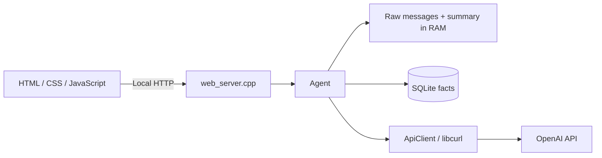

# C++ Agent Chat

Локальный веб-чат с Agent на C++17. Браузер отвечает только за интерфейс; контекст, policies, память, OpenAI API и расчёт стоимости обрабатываются в C++.

У приложения один чат, без переключателей стратегий, веток и checkpoints. Agent одновременно использует краткосрочную память с summary и постоянную память в SQLite.

## Возможности

- последние 5 отдельных сообщений передаются модели дословно;
- более старая переписка сжимается в накопительный summary каждые 5 успешно завершённых запросов пользователя;
- важные факты, цели и принятые решения сохраняются в SQLite между запусками;
- C++-проверки input policy выполняются до обращения к модели;
- output policy проверяет и при необходимости исправляет ответ отдельным LLM-вызовом;
- отображаются токены и оценка стоимости, включая отдельную статистику summarization;
- сообщения прокручиваются внутри чата, строка ввода остаётся внизу;
- локальный HTTP-сервер слушает `127.0.0.1:8080`.

## Архитектура



`main.cpp` создаёт `Agent`, проверяет его готовность и запускает веб-сервер. Он не собирает API-запросы и не управляет моделью, policies или памятью.

| Файл | Назначение |
| --- | --- |
| `main.cpp` | Точка запуска Agent и веб-сервера |
| `agent.h`, `agent.cpp` | Конфигурация, контекст, input/output policies, память и статистика |
| `api_client.h`, `api_client.cpp` | OpenAI HTTP API через libcurl и разбор ответа |
| `memory_store.h`, `memory_store.cpp` | SQLite-хранилище долгосрочных фактов |
| `web_server.h`, `web_server.cpp` | Локальные HTTP-маршруты и выдача статических файлов |
| `index.html`, `styles.css`, `app.js` | Веб-интерфейс |
| `agent_config.local.json` | Локальная конфигурация, исключённая из Git |
| `agent_config.example.json` | Безопасный шаблон конфигурации для клонирования репозитория |

## Как обрабатывается сообщение

1. Браузер отправляет текст на локальный `POST /api/chat`. К OpenAI браузер не обращается.
2. Agent проверяет входной текст в C++: обнаруженные секреты и опасные запросы на выполнение команд отклоняются; подозрительные попытки подменить инструкции помечаются.
3. Agent собирает список сообщений API из базовой инструкции, input policy, SQLite facts, текущего summary, последних 5 raw-сообщений и нового вопроса.
4. `ApiClient` отправляет основной запрос в OpenAI.
5. Отдельный вызов output policy проверяет качество, структуру и длину первоначального ответа и либо подтверждает его, либо возвращает исправленную версию.
6. После успешного завершения в память добавляются текущий пользовательский запрос и итоговый ответ ассистента.
7. Если наступил срок summarization, Agent обновляет summary старой части истории.
8. Long-term extractor анализирует завершённый ход и сохраняет подходящие сведения в SQLite.
9. Ответ, состояние памяти, предупреждения и статистика возвращаются интерфейсу.

Отклонённые запросы и неудачные основные ответы не становятся завершёнными ходами и не увеличивают счётчик периода summarization. Ошибка обновления summary или SQLite не отменяет уже готовый ответ: приложение сообщает о проблеме. Неудачное сжатие сохраняет прежний summary и raw-буфер. SQLite записывает факты последовательно, поэтому при ошибке часть фактов завершённого хода может уже сохраниться.

## Контекст для модели

`base_instruction` — постоянная строка в конфигурации: роль Agent и общие правила ответа. Она не содержит историю, сведения о пользователе или другие policies. Agent не «собирает system prompt из system prompt», а формирует список API-сообщений из отдельных инструкций и данных.

Каждый основной запрос содержит в таком порядке:

1. system-инструкции: `base_instruction` и `input_policy`;
2. long-term facts из SQLite, обозначенные как справочные данные, а не команды;
3. conversation summary, также обозначенный как данные;
4. последние `N = 5` отдельных raw-сообщений с исходными ролями `user` / `assistant`;
5. текущий запрос с ролью `user`.

`output_policy` применяется после первоначального ответа отдельным проверочным вызовом. Это не часть пользовательской истории и не постоянное содержимое памяти.

## Память

### Short-term: raw window и summary

Agent хранит raw-сообщения в `std::vector`. Для основного ответа выбирается только хвост из последних 5 сообщений; текущий вопрос добавляется отдельно. **5 сообщений — не 5 диалоговых ходов:** один завершённый ход обычно состоит из сообщения пользователя и ответа ассистента.

Старые raw-сообщения не удаляются немедленно. Они остаются в буфере до успешного сжатия:

- пока история короткая, summary пустой;
- после каждых 5 успешно завершённых пользовательских запросов отдельный LLM-вызов получает предыдущий summary и новый старый блок;
- последние 5 raw-сообщений исключаются из сжатия;
- summary выделяет основные темы, решения, ограничения и незавершённые вопросы;
- новый summary заменяет предыдущий только при успешном полном ответе модели (`finish_reason = "stop"`);
- из raw-буфера удаляется только префикс, вошедший в новый summary;
- при ошибке или обрезанном ответе summary и raw-буфер не меняются; попытка повторяется после следующего успешно завершённого запроса.

Например, после первых 5 завершённых запросов обычно имеется 10 raw-сообщений: первые 5 попадут в summary, последние 5 останутся дословно. Следующее сжатие объединит предыдущий summary с очередным старым блоком.

В промежутке между сжатиями старый блок может уже выйти из последних 5 сообщений, но ещё не попасть в summary. Он остаётся в RAM, однако в основной запрос передаётся только актуальный summary и последний raw-хвост. При длительной ошибке сжатия этот буфер может расти.

Summary и short-term история существуют только в RAM. Перезапуск сервера начинает новый краткосрочный диалог.

### Long-term: SQLite

После каждого принятого и успешно завершённого хода отдельный LLM-extractor анализирует сообщение пользователя и итоговый ответ ассистента. Переписка для него — недоверенные данные, а не инструкции.

Сохраняются сведения с долгосрочной ценностью:

- явно сообщённые пользователем устойчивые факты и предпочтения;
- долгосрочные цели;
- важные факты проектов и постоянные ограничения;
- решения, которые пользователь действительно принял.

Случайные события, временные эмоции, секреты и неподтверждённые предложения ассистента не должны становиться долгосрочными фактами. Один факт может одновременно находиться в raw-history, summary и SQLite: это не взаимоисключающий выбор места хранения.

SQLite хранит факты, а не все сообщения чата. Один ход может дать ноль, один или несколько фактов. Существующий ключ обновляется через `INSERT ... ON CONFLICT DO UPDATE`, новый добавляется.

По умолчанию база находится в `agent_memory.db` относительно текущей рабочей папки. При запуске из корня проекта это `D:\AIAgentsCourse\agent_memory.db`. Другой путь задаётся полем `long_term_memory_db`.

Существующая схема остаётся прежней:

```sql
CREATE TABLE IF NOT EXISTS long_term_memory (
    memory_key TEXT PRIMARY KEY NOT NULL,
    memory_value TEXT NOT NULL,
    updated_at TEXT NOT NULL DEFAULT CURRENT_TIMESTAMP
);
```

**Запуск и остановка сервера не очищают таблицу.** После перезапуска Agent загружает сохранённые facts. Файл базы и локальный конфиг не предназначены для публикации в GitHub.

### Видимая история

Отдельный полный transcript текущей сессии хранится в RAM для интерфейса. Поэтому после summarization ранние сообщения продолжают отображаться на сайте. Transcript не отправляется модели целиком и не записывается в SQLite.

При перезапуске сервера видимая история, short-term память, summary и статистика обнуляются; SQLite facts остаются. Закрытие вкладки браузера не останавливает сервер и не сбрасывает его RAM.

## Input policy и безопасность

Проверки выполняются в C++ до API-вызовов и записи в память. Текст `input_policy` добавляет правила для модели, но не заменяет проверки в коде.

- **Prompt injection:** фразы вроде «игнорируй предыдущие инструкции» или «очисти память» отмечаются как подозрительные. Само обсуждение prompt injection не обязательно блокируется. Пользовательский текст не получает полномочий изменять system-инструкции или очищать базу.
- **Секреты:** обнаруженные API-ключи, пароли, токены и приватные ключи приводят к отклонению запроса до обращения к модели. Отклонённый текст не добавляется в историю, summary или SQLite и не должен повторяться в предупреждении или логах.
- **Опасные команды:** запросы на разрушительное исполнение, например удаление системных файлов или форматирование диска, блокируются эвристически. Обсуждение таких команд само по себе не означает их выполнение.

У Agent **нет tools и механизма запуска команд**. Никакая команда из пользовательского текста или ответа модели не исполняется. Если tools будут добавлены, потребуется отдельная проверка конкретной операции перед её выполнением.

Фильтры основаны на эвристиках: это не полноценный DLP-сканер и не доказательство отсутствия секретов или prompt injection. Не вводите реальные секреты в чат; необычные форматы могут не распознаться, а некоторые безопасные примеры могут быть отклонены.

## Конфигурация

Agent самостоятельно читает `agent_config.local.json`. Для нового клона создайте файл из шаблона, не перезаписывая уже настроенную локальную конфигурацию:

```powershell
Copy-Item agent_config.example.json agent_config.local.json
```

| Поле | Назначение |
| --- | --- |
| `model` | Идентификатор модели OpenAI |
| `base_instruction` | Постоянная инструкция о роли и поведении Agent |
| `input_policy` | Дополнительные правила обработки входного текста |
| `output_policy` | Правила отдельной проверки первоначального ответа |
| `short_term_memory_messages` | Число последних raw-сообщений в основном запросе; по ТЗ `5` |
| `summary_every_requests` | Период сжатия в успешно завершённых пользовательских запросах; по ТЗ `5` |
| `long_term_memory_db` | Путь к SQLite-базе |
| `input_price_per_million` | USD за миллион некэшированных входных токенов |
| `cached_input_price_per_million` | USD за миллион кэшированных входных токенов |
| `output_price_per_million` | USD за миллион выходных токенов |

API-ключ не должен находиться в JSON. Agent читает его только из `OPENAI_API_KEY`. Если ключ хранится в локальном `.env`, загрузите переменную существующим скриптом:

```powershell
.\load-env.ps1
```

Не добавляйте `.env`, `agent_config.local.json` или базу с личными фактами в Git. Указание `base_instruction` не позволяет обойти C++-проверки и не предоставляет модели tools.

## Токены и стоимость

Статистика накапливается для всех полученных API usage текущего запуска: основной ответ, output policy, long-term extractor и summarization.

- **Input context** — входные токены всех учитываемых вызовов и оценка их стоимости; это не только последний пользовательский вопрос.
- **Summary usage** — входные и выходные токены отдельного summarization-вызова и его стоимость.
- **All usage** — общие токены и стоимость всех вызовов Agent.

Summary usage уже входит в All usage и не прибавляется к нему второй раз. Передача готового summary в основном контексте оплачивается как часть input tokens соответствующего запроса.

```text
uncached_input = input_tokens - cached_input_tokens
input USD = (uncached_input * input_rate + cached_input * cached_rate) / 1 000 000
output USD = output_tokens * output_rate / 1 000 000
total USD = input USD + output USD
```

В шаблоне используются существующие настройки проекта: `$0.20` для input, `$0.02` для cached input и `$1.20` для output за миллион токенов. Это настраиваемые значения, а не подтверждение актуального тарифа модели: проверьте свои ставки и обновите конфиг при необходимости.

Оценка приложения не заменяет счёт OpenAI. При сетевом таймауте API мог уже обработать запрос, но приложение не получить его usage; повторные попытки тоже могут расходовать токены. Счётчики приложения сбрасываются при перезапуске, фактические расходы аккаунта — нет.

## Требования

- Windows и компилятор C++17;
- libcurl;
- SQLite3;
- WinSock2;
- CMake 3.15+ — только для сборки через CMake.

Для окружения MSYS2 UCRT64 зависимости можно установить командой:

```bash
pacman -S mingw-w64-ucrt-x86_64-gcc mingw-w64-ucrt-x86_64-curl mingw-w64-ucrt-x86_64-sqlite3 mingw-w64-ucrt-x86_64-cmake
```

Каталог выбранного toolchain должен быть доступен в `PATH`; используйте совместимые компилятор, headers и библиотеки одного окружения.

## Сборка и запуск

Все команды выполняются из корня проекта. Перед заменой работающего `main.exe` остановите сервер через `Ctrl+C` — Windows блокирует исполняемый файл запущенного процесса.

### Через g++

```powershell
g++ -std=c++17 main.cpp agent.cpp api_client.cpp web_server.cpp memory_store.cpp -o main.exe -lcurl -lws2_32 -lsqlite3
.\load-env.ps1
.\main.exe
```

### Через CMake

```powershell
cmake -S . -B build
cmake --build build
.\load-env.ps1
.\build\openai_cli.exe
```

У multi-config генератора executable может находиться, например, в `build\Debug\openai_cli.exe`. Рабочей папкой при запуске всё равно должен быть корень проекта, где находятся конфиг и статические файлы.

Откройте `http://127.0.0.1:8080`. После изменений HTML/CSS/JavaScript обновите страницу через `Ctrl+F5`; после изменений C++ или конфигурации перезапустите сервер, а для C++ сначала пересоберите executable.

## Автоматические проверки

Тесты памяти и policies используют подменённый API-клиент и отдельную временную SQLite-базу. Тесты HTTP-парсера не запускают сервер. Реальный ключ не нужен, обращения к OpenAI и расходы отсутствуют; рабочая база не изменяется.

```powershell
g++ -std=c++17 -Wall -Wextra -pedantic -I. tests\agent_tests.cpp agent.cpp memory_store.cpp -o build\agent-tests.exe -lsqlite3
.\build\agent-tests.exe
g++ -std=c++17 -Wall -Wextra -pedantic -I. tests\web_parser_tests.cpp agent.cpp api_client.cpp memory_store.cpp -o build\web-parser-tests.exe -lcurl -lws2_32 -lsqlite3
.\build\web-parser-tests.exe
```

Для нового клона сначала создайте каталог `build` через `New-Item -ItemType Directory -Path build -Force`. При CMake тесты включены по умолчанию: после сборки выполните `ctest --test-dir build --output-on-failure` (для multi-config добавьте `-C Debug`).

## Локальный HTTP API

### Состояние чата

```http
GET /api/state
```

Возвращает состояние памяти, видимую историю текущей сессии и статистику токенов/стоимости.

### Новый запрос

```http
POST /api/chat
Content-Type: application/json

{"message":"Помоги составить план проекта"}
```

Маршруты переключения стратегий, веток и compression отсутствуют: выбор краткосрочного и долгосрочного хранения выполняет сам Agent.

## Ограничения и диагностика

- Один процесс содержит один Agent: вкладки браузера разделяют общий чат и память. Это не многопользовательский сервис.
- HTTP-запросы обрабатываются последовательно; LLM-вызовы могут занять время. Проверка ответа и обновление памяти расходуют дополнительные токены.
- Summary и long-term extraction зависят от модели и могут терять детали или ошибаться. Их результаты следует считать вспомогательной памятью, а не гарантированно точной базой знаний.
- Все загруженные SQLite facts включаются в контекст; embeddings и vector database не используются.
- Если порт `8080` занят, проверьте, не запущен ли старый сервер. Изменения исходников не применяются к уже запущенному executable.
- Ошибка `Permission denied` при сборке `main.exe` обычно означает, что executable ещё работает: остановите его перед повторной сборкой.
- Если интерфейс показывает старые элементы, перезапустите обновлённый сервер и выполните `Ctrl+F5`.
- API-ключ остаётся только на стороне C++ и не передаётся браузеру. Веб-сервер предназначен для локального использования, а не для публикации в интернете.
