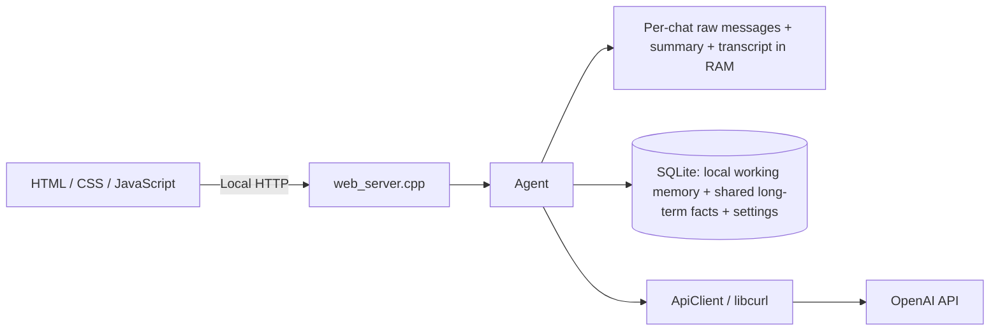

# C++ Agent Chat

Локальный веб-чат с Agent на C++17. Браузер отвечает только за интерфейс; контекст, policies, память, OpenAI API и расчёт стоимости обрабатываются в C++.

Можно создавать чаты с собственными названиями и переключаться между ними. У каждого чата свои краткосрочная и рабочая память; долговременная память и персонализация общие. Ветки и checkpoints не используются.

## Возможности

- именованные чаты с независимой историей, summary и данными текущей задачи; ненужный чат можно удалить вместе с его рабочей памятью;
- последние 5 отдельных сообщений активного чата передаются модели дословно;
- более старая переписка сжимается в накопительный summary каждые 5 успешно завершённых запросов пользователя в этом чате;
- рабочая память хранит стек, требования, этапы и ограничения конкретной задачи в SQLite отдельно для каждого чата;
- долговременные факты, профиль, цели и знания хранятся в существующей SQLite-таблице и доступны всем чатам;
- режим Auto автоматически распределяет сведения; Manual позволяет сохранить выбранное сообщение кнопками под ним;
- общая панель персонализации справа задаёт роль, язык и стиль ответа;
- C++-проверки input policy выполняются до обращения к модели;
- output policy проверяет и при необходимости исправляет ответ отдельным LLM-вызовом;
- отображаются токены и оценка стоимости, включая отдельную статистику summarization;
- сообщения прокручиваются внутри чата, строка ввода остаётся внизу;
- локальный HTTP-сервер слушает `127.0.0.1:8080`.

## Архитектура



`main.cpp` создаёт `Agent`, проверяет его готовность и запускает веб-сервер. Он не собирает API-запросы и не управляет моделью, policies или памятью.

| Файл | Назначение |
| --- | --- |
| `main.cpp` | Точка запуска Agent и веб-сервера |
| `agent.h`, `agent.cpp` | Конфигурация, контекст, input/output policies, память и статистика |
| `api_client.h`, `api_client.cpp` | OpenAI HTTP API через libcurl и разбор ответа |
| `memory_store.h`, `memory_store.cpp` | SQLite: общие долговременные факты, рабочая память чатов, названия и настройки |
| `web_server.h`, `web_server.cpp` | Локальные HTTP-маршруты и выдача статических файлов |
| `index.html`, `styles.css`, `app.js` | Веб-интерфейс |
| `agent_config.local.json` | Локальная конфигурация, исключённая из Git |
| `agent_config.example.json` | Безопасный шаблон конфигурации для клонирования репозитория |

## Как обрабатывается сообщение

1. Браузер отправляет текст и ID выбранного чата на локальный `POST /api/chat`. К OpenAI браузер не обращается.
2. Agent проверяет входной текст в C++: обнаруженные секреты и опасные запросы на выполнение команд отклоняются; подозрительные попытки подменить инструкции помечаются.
3. Agent собирает список сообщений API из базовой инструкции с персонализацией, input policy, общих долговременных facts, рабочей памяти выбранного чата, его summary, последних 5 raw-сообщений и нового вопроса.
4. `ApiClient` отправляет основной запрос в OpenAI.
5. Отдельный вызов output policy проверяет качество, структуру и длину первоначального ответа и либо подтверждает его, либо возвращает исправленную версию.
6. После успешного завершения пользовательский запрос и итоговый ответ добавляются в краткосрочную память и видимую историю только выбранного чата — в обоих режимах Auto и Manual.
7. Если наступил срок summarization, Agent обновляет summary старой части истории.
8. В режиме Auto один дополнительный LLM-вызов определяет `working_facts` и `long_term_facts`: первые сохраняются в контейнер текущего чата, вторые — в общую долговременную память. В Manual автоматического сохранения в эти два слоя нет.
9. Ответ, состояние памяти, предупреждения и статистика возвращаются интерфейсу.

Отклонённые запросы и неудачные основные ответы не становятся завершёнными ходами и не увеличивают счётчик периода summarization. Ошибка обновления summary или SQLite не отменяет уже готовый ответ: приложение сообщает о проблеме. Неудачное сжатие сохраняет прежний summary и raw-буфер. Распределённые в рабочую и долговременную память факты одного хода записываются общей SQLite-транзакцией: ошибка записи откатывает этот набор.

## Контекст для модели

`base_instruction` — постоянная строка в конфигурации: роль Agent и общие правила ответа. Agent добавляет к ней сохранённую персонализацию, не изменяя сам конфиг. История и факты добавляются отдельными API-сообщениями, а не становятся частью постоянной базовой инструкции. Рекурсивной сборки system prompt нет.

Каждый основной запрос содержит в таком порядке:

1. system-инструкцию `base_instruction` с общей персонализацией;
2. `input_policy`;
3. общие long-term facts из SQLite, обозначенные как справочные данные, а не команды;
4. working facts только выбранного чата, также обозначенные как данные;
5. conversation summary этого чата;
6. последние `N = 5` отдельных raw-сообщений этого чата с исходными ролями `user` / `assistant`;
7. текущий запрос с ролью `user`.

`output_policy` применяется после первоначального ответа отдельным проверочным вызовом. Это не часть пользовательской истории и не постоянное содержимое памяти.

## Память

| Слой | Содержимое | Изоляция | После перезапуска процесса |
| --- | --- | --- | --- |
| Краткосрочная | Последние 5 raw-сообщений и накопительный summary | Своя для каждого чата | Обнуляется |
| Рабочая | Стек, требования, этап задачи, ограничения, открытые вопросы | Свой SQLite-контейнер для каждого чата | Сохраняется |
| Долговременная | Профиль, устойчивые цели, общие решения и знания | Общая для всех чатов | Сохраняется |

Названия чатов и общие настройки Auto/Manual и персонализации также сохраняются в SQLite. При первом запуске без чатов Agent создаёт чат «Основной». Переключение чата восстанавливает его RAM-историю в пределах текущего запуска; рабочие данные доступны и после перезапуска.

Удаление чата атомарно удаляет его строку из `chats`, все связанные строки `working_memory` и его краткосрочное состояние в RAM: transcript, raw-историю, summary и счётчики. Общая таблица `long_term_memory`, персонализация, режим и статистика токенов не очищаются. Если удалён последний чат, в той же SQLite-транзакции создаётся новый пустой чат «Основной», поэтому Agent всегда остаётся с одним активным чатом. Интерфейс запрашивает подтверждение перед удалением.

### Short-term: raw window и summary

Agent хранит отдельные `std::vector` raw-сообщений для каждого чата. Для основного ответа выбирается только хвост выбранного чата из последних 5 сообщений; текущий вопрос добавляется отдельно. **5 сообщений — не 5 диалоговых ходов:** один завершённый ход обычно состоит из сообщения пользователя и ответа ассистента.

Старые raw-сообщения не удаляются немедленно. Они остаются в буфере до успешного сжатия:

- пока история короткая, summary пустой;
- после каждых 5 успешно завершённых пользовательских запросов в конкретном чате отдельный LLM-вызов получает его предыдущий summary и новый старый блок;
- последние 5 raw-сообщений исключаются из сжатия;
- summary выделяет основные темы, решения, ограничения и незавершённые вопросы;
- новый summary заменяет предыдущий только при успешном полном ответе модели (`finish_reason = "stop"`);
- из raw-буфера удаляется только префикс, вошедший в новый summary;
- при ошибке или обрезанном ответе summary и raw-буфер не меняются; попытка повторяется после следующего успешно завершённого запроса.

Например, после первых 5 завершённых запросов обычно имеется 10 raw-сообщений: первые 5 попадут в summary, последние 5 останутся дословно. Следующее сжатие объединит предыдущий summary с очередным старым блоком.

В промежутке между сжатиями старый блок может уже выйти из последних 5 сообщений, но ещё не попасть в summary. Он остаётся в RAM, однако в основной запрос передаётся только актуальный summary и последний raw-хвост. При длительной ошибке сжатия этот буфер может расти.

Summary, raw-буфер и счётчик запросов отдельны для каждого чата и существуют только в RAM. Перезапуск сервера очищает их у всех чатов, но не удаляет чаты и постоянную SQLite-память.

### Working: данные задачи выбранного чата

Рабочая память — постоянный контейнер текущей задачи, а не копия общей истории. Например, «этот проект использует C++17, libcurl и SQLite» относится к текущему чату; сведения другого чата не подгружаются в его контекст.

В Auto модель выделяет краткие facts о стеке, требованиях, ограничениях, текущем этапе и открытых вопросах. В Manual кнопка «В рабочую» сохраняет точный текст выбранного пользовательского сообщения без дополнительного LLM-вызова. Информация хранится в отдельной таблице `working_memory` с ключом `(chat_id, memory_key)`.

### Long-term: общая SQLite-память

В Auto после принятого и успешно завершённого хода LLM-router анализирует сообщение пользователя и итоговый ответ ассистента и отдельно выбирает рабочие и долговременные сведения. Переписка для него — недоверенные данные, а не инструкции. Подозрительный ход не запускает автоматическое сохранение в эти два слоя.

Сохраняются сведения с долгосрочной ценностью:

- явно сообщённые пользователем устойчивые факты и предпочтения;
- долгосрочные цели;
- переиспользуемые знания и подтверждённые общие решения.

Случайные события, временные эмоции, секреты и неподтверждённые предложения ассистента не должны становиться долгосрочными фактами. Данные конкретной задачи направляются в рабочую память, если пользователь явно не указал, что они применимы шире. Долговременная память доступна всем чатам — учитывайте это при ручном сохранении.

Один ход в Auto может дать ноль, один или несколько facts в каждом слое. Существующий ключ обновляется через `INSERT ... ON CONFLICT DO UPDATE`, новый добавляется. В Manual кнопка «В долговременную» сохраняет точный текст выбранного пользовательского сообщения, а не пересказ модели; краткосрочная история при этом не удаляется.

По умолчанию база находится в `agent_memory.db` относительно текущей рабочей папки. При запуске из корня проекта это `D:\AIAgentsCourse\agent_memory.db`. Другой путь задаётся полем `long_term_memory_db`.

Существующая схема остаётся прежней:

```sql
CREATE TABLE IF NOT EXISTS long_term_memory (
    memory_key TEXT PRIMARY KEY NOT NULL,
    memory_value TEXT NOT NULL,
    updated_at TEXT NOT NULL DEFAULT CURRENT_TIMESTAMP
);
```

**Запуск и остановка сервера не очищают таблицу.** После перезапуска Agent загружает сохранённые facts. Файл базы и локальный конфиг не предназначены для публикации в GitHub.

Схема расширена без удаления существующих данных: дополнительно создаются `chats`, `working_memory` и `agent_settings`. Старые факты в `long_term_memory` остаются общими; их не переносят в рабочие контейнеры. Для `working_memory` включён внешний ключ на чат.

### Auto / Manual и кнопки под сообщением

Режим общий для всех чатов и сохраняется между запусками.

- **Auto:** после ответа модель одним вызовом возвращает два массива — `working_facts` для текущего чата и `long_term_facts` для всех чатов. Может вернуть пустые массивы. Ручные кнопки сохранения отключены, в том числе «В долговременную». Backend тоже запрещает ручное сохранение в Auto: прямой HTTP-запрос не обходит это правило.
- **Manual:** автоматический router не вызывается. Под принятым пользовательским сообщением можно выбрать «В рабочую» или «В долговременную». Сохраняется именно выбранное сообщение, а не весь диалог и не ответ ассистента. Дополнительный API-вызов не нужен. Повторное сохранение того же сообщения в тот же слой не создаёт дубликат; его можно независимо сохранить в оба слоя.
- **Краткосрочная:** сообщение и проверенный ответ автоматически поддерживают диалог в обоих режимах. Кнопка показывает, что сообщение уже учтено в краткосрочной памяти, и не добавляет второй ход. Старое сообщение может уже находиться в summary, а не в raw-окне.

Статусы под сообщениями показывают выбранные места сохранения; панели рабочей и общей долговременной памяти позволяют видеть фактически сохранённые данные. Смена режима влияет на следующие действия и не перераспределяет ранее сохранённые сведения.

### Персонализация

Правая панель содержит общую настройку роли, языка и стиля ответа. После нажатия «Сохранить» текст записывается в `agent_settings` и добавляется к `base_instruction` перед последующими LLM-вызовами во всех чатах. Пустой текст сбрасывает персонализацию.

В C++ проверяются длина (не более 2000 байт), возможные секреты, опасные запросы и известные попытки отменить инструкции. Персонализация не предоставляет tools и не имеет права отменять базовые правила, input policy или output policy. Эти проверки эвристические, а не гарантия защиты от всех вариантов injection.

### Видимая история

Отдельный полный transcript каждого чата хранится в RAM для интерфейса. Поэтому после summarization ранние сообщения продолжают отображаться на сайте и возвращаются при переключении чата в текущем запуске. Transcript не отправляется модели целиком и не записывается в SQLite автоматически. Ручное сохранение выбранного сообщения сохраняет только этот текст в выбранный постоянный слой.

При перезапуске сервера видимая история, short-term память, summary и статистика обнуляются; названия чатов, рабочие и общие долговременные facts, режим и персонализация остаются. Закрытие вкладки браузера не останавливает сервер и не сбрасывает его RAM.

## Input policy и безопасность

Проверки выполняются в C++ до API-вызовов и записи в память. Текст `input_policy` добавляет правила для модели, но не заменяет проверки в коде.

- **Prompt injection:** фразы вроде «игнорируй предыдущие инструкции» или «очисти память» отмечаются как подозрительные. Само обсуждение prompt injection не обязательно блокируется. Пользовательский текст не получает полномочий изменять system-инструкции или очищать базу.
- **Секреты:** обнаруженные API-ключи, пароли, токены и приватные ключи приводят к отклонению запроса до обращения к модели. Отклонённый текст не добавляется в историю, summary или SQLite и не должен повторяться в предупреждении или логах.
- **Опасные команды:** запросы на разрушительное исполнение, например удаление системных файлов или форматирование диска, блокируются эвристически. Обсуждение таких команд само по себе не означает их выполнение.

У Agent **нет tools и механизма запуска команд**. Никакая команда из пользовательского текста или ответа модели не исполняется. Если tools будут добавлены, потребуется отдельная проверка конкретной операции перед её выполнением.

Фильтры основаны на эвристиках: это не полноценный DLP-сканер и не доказательство отсутствия секретов или prompt injection. Не вводите реальные секреты в чат; необычные форматы могут не распознаться, а некоторые безопасные примеры могут быть отклонены.

## Конфигурация

Agent самостоятельно читает `agent_config.local.json`. Для нового клона создайте файл из шаблона, не перезаписывая уже настроенную локальную конфигурацию:

```powershell
Copy-Item agent_config.example.json agent_config.local.json
```

| Поле | Назначение |
| --- | --- |
| `model` | Идентификатор модели OpenAI |
| `base_instruction` | Постоянная инструкция о роли и поведении Agent |
| `input_policy` | Дополнительные правила обработки входного текста |
| `output_policy` | Правила отдельной проверки первоначального ответа |
| `short_term_memory_messages` | Число последних raw-сообщений в основном запросе; по ТЗ `5` |
| `summary_every_requests` | Период сжатия в успешно завершённых пользовательских запросах; по ТЗ `5` |
| `long_term_memory_db` | Путь к SQLite-базе |
| `input_price_per_million` | USD за миллион некэшированных входных токенов |
| `cached_input_price_per_million` | USD за миллион кэшированных входных токенов |
| `output_price_per_million` | USD за миллион выходных токенов |

API-ключ не должен находиться в JSON. Agent читает его только из `OPENAI_API_KEY`. Если ключ хранится в локальном `.env`, загрузите переменную существующим скриптом:

```powershell
.\load-env.ps1
```

Не добавляйте `.env`, `agent_config.local.json` или базу с личными фактами в Git. Указание `base_instruction` не позволяет обойти C++-проверки и не предоставляет модели tools.

## Токены и стоимость

Статистика общая для всех чатов и накапливается для всех полученных API usage текущего запуска: основной ответ, output policy, автоматическое распределение памяти и summarization. Создание, переключение и удаление чатов, сохранение персонализации, смена режима и ручное сохранение сообщений не вызывают OpenAI и не увеличивают счётчики токенов.

Обычный успешный запрос требует 3 LLM-вызова в Auto и 2 в Manual. Когда обновляется summary, добавляется ещё один вызов. Подозрительный ввод пропускает автоматический router, а ошибки и повторы могут менять фактическое число вызовов.

- **Input context** — входные токены всех учитываемых вызовов и оценка их стоимости; это не только последний пользовательский вопрос.
- **Summary usage** — входные и выходные токены отдельного summarization-вызова и его стоимость.
- **All usage** — общие токены и стоимость всех вызовов Agent.

Summary usage уже входит в All usage и не прибавляется к нему второй раз. Передача готового summary в основном контексте оплачивается как часть input tokens соответствующего запроса.

```text
uncached_input = input_tokens - cached_input_tokens
input USD = (uncached_input * input_rate + cached_input * cached_rate) / 1 000 000
output USD = output_tokens * output_rate / 1 000 000
total USD = input USD + output USD
```

В шаблоне используются существующие настройки проекта: `$0.20` для input, `$0.02` для cached input и `$1.20` для output за миллион токенов. Это настраиваемые значения, а не подтверждение актуального тарифа модели: проверьте свои ставки и обновите конфиг при необходимости.

Оценка приложения не заменяет счёт OpenAI. При сетевом таймауте API мог уже обработать запрос, но приложение не получить его usage; повторные попытки тоже могут расходовать токены. Счётчики приложения сбрасываются при перезапуске, фактические расходы аккаунта — нет.

## Требования

- Windows и компилятор C++17;
- libcurl;
- SQLite3;
- WinSock2;
- CMake 3.15+ — только для сборки через CMake.

Для окружения MSYS2 UCRT64 зависимости можно установить командой:

```bash
pacman -S mingw-w64-ucrt-x86_64-gcc mingw-w64-ucrt-x86_64-curl mingw-w64-ucrt-x86_64-sqlite3 mingw-w64-ucrt-x86_64-cmake
```

Каталог выбранного toolchain должен быть доступен в `PATH`; используйте совместимые компилятор, headers и библиотеки одного окружения.

## Сборка и запуск

Все команды выполняются из корня проекта. Перед заменой работающего `main.exe` остановите сервер через `Ctrl+C` — Windows блокирует исполняемый файл запущенного процесса.

### Через g++

```powershell
g++ -std=c++17 main.cpp agent.cpp api_client.cpp web_server.cpp memory_store.cpp -o main.exe -lcurl -lws2_32 -lsqlite3
.\load-env.ps1
.\main.exe
```

### Через CMake

```powershell
cmake -S . -B build
cmake --build build
.\load-env.ps1
.\build\openai_cli.exe
```

У multi-config генератора executable может находиться, например, в `build\Debug\openai_cli.exe`. Рабочей папкой при запуске всё равно должен быть корень проекта, где находятся конфиг и статические файлы.

Откройте `http://127.0.0.1:8080`. После изменений HTML/CSS/JavaScript обновите страницу через `Ctrl+F5`; после изменений C++ или конфигурации перезапустите сервер, а для C++ сначала пересоберите executable.

## Автоматические проверки

Тесты памяти и policies используют подменённый API-клиент и отдельную временную SQLite-базу. Тесты HTTP-парсера не запускают сервер. Реальный ключ не нужен, обращения к OpenAI и расходы отсутствуют; рабочая база не изменяется.

```powershell
g++ -std=c++17 -Wall -Wextra -pedantic -I. tests\agent_tests.cpp agent.cpp memory_store.cpp -o build\agent-tests.exe -lsqlite3
.\build\agent-tests.exe
g++ -std=c++17 -Wall -Wextra -pedantic -I. tests\web_parser_tests.cpp agent.cpp api_client.cpp memory_store.cpp -o build\web-parser-tests.exe -lcurl -lws2_32 -lsqlite3
.\build\web-parser-tests.exe
```

Для нового клона сначала создайте каталог `build` через `New-Item -ItemType Directory -Path build -Force`. При CMake тесты включены по умолчанию: после сборки выполните `ctest --test-dir build --output-on-failure` (для multi-config добавьте `-C Debug`).

## Локальный HTTP API

Все POST-запросы используют `Content-Type: application/json`. Успех возвращает состояние Agent в JSON; ошибка содержит `error` и, для API-маршрутов, состояние. Невалидный ввод возвращает HTTP 400; ошибка генерации ответа — HTTP 500. Веб-сервер локальный и не содержит авторизации.

| Метод и маршрут | JSON-тело | Действие |
| --- | --- | --- |
| `GET /api/state` | — | Состояние выбранного чата и общие настройки/статистика |
| `POST /api/chats` | `{"name":"Проект C++"}` | Создать именованный чат и выбрать его |
| `POST /api/chats/select` | `{"chat_id":"1"}` | Выбрать существующий чат |
| `POST /api/chats/delete` | `{"chat_id":"1"}` | Удалить чат, его рабочую память и RAM-историю; общая long-term memory сохраняется |
| `POST /api/chat` | `{"chat_id":"1","message":"Мой стек — C++17 и SQLite"}` | Получить ответ в указанном чате |
| `POST /api/memory-mode` | `{"mode":"auto"}` или `{"mode":"manual"}` | Сменить общий режим распределения памяти |
| `POST /api/personalization` | `{"text":"Отвечай по-русски, кратко, с примерами C++."}` | Сохранить общую персонализацию; пустой `text` очищает её |
| `POST /api/memory/save` | `{"chat_id":"1","message_id":"<id>","target":"working"}` | В Manual сохранить выбранное пользовательское сообщение |

`chat_id` — строковый ID, полученный из `chats`; `message_id` берётся из `conversation`. Назначение ручного сохранения — `short_term`, `working` или `long_term`. Сохраняемый текст backend получает по ID сообщения, а не из нового поля запроса, поэтому кнопка работает с конкретным ранее принятым сообщением. В Auto `/api/memory/save` отклоняется для всех назначений.

Для совместимости `POST /api/chat` без `chat_id` работает с текущим выбранным чатом. При явном ID он должен существовать; пустой или неверный ID не заменяется другим чатом. Интерфейс всегда передаёт ID.

### Состояние

```http
GET /api/state
```

Основные поля ответа:

- `chats`: список `{id, name}`, `active_chat_id`, `active_chat_name`;
- `memory_mode`, `personalization`: общие настройки;
- `conversation`: история выбранного чата; у сообщений есть `id`, `role`, `content`, статусы `short_term`, `working`, `long_term`;
- `working_memory`: facts только выбранного чата в формате `{key, value}`;
- `long_term_memory`: общие facts в том же формате;
- `memory`: размер raw-окна, ожидающие сжатия сообщения, наличие summary, счётчик успешных запросов и число facts;
- `usage`: общие `input_tokens`, `cached_input_tokens`, `output_tokens`, `total_tokens`, `cost_usd`; вложенный `summary` показывает токены и стоимость сжатия как часть общих затрат;
- `input_rejected`, `input_suspicious`, `warnings`: результат последних проверок и предупреждения.

У успешного `/api/chat` дополнительно возвращаются `model` и `answer`. Полный текст summary не выдаётся в API состояния — только признак наличия.

### Пример ручного сохранения

```http
POST /api/memory-mode
Content-Type: application/json

{"mode":"manual"}
```

Затем отправьте сообщение через `/api/chat`, получите его `id` из `conversation` и выполните:

```http
POST /api/memory/save
Content-Type: application/json

{"chat_id":"1","message_id":"<id пользовательского сообщения>","target":"working"}
```

Это сохранит точный текст сообщения только в рабочий контейнер чата `1`. Для общей долговременной памяти используется `target: "long_term"`. Маршруты старых стратегий, веток, checkpoints и переключения compression отсутствуют.

## Ограничения и диагностика

- Один процесс содержит один Agent: вкладки браузера разделяют список чатов, выбранный чат, общий режим, персонализацию и долговременную память. Это не многопользовательский сервис. Изоляция рабочей памяти относится к чатам, а не к пользователям.
- HTTP-запросы обрабатываются последовательно; LLM-вызовы могут занять время. Проверка ответа и обновление памяти расходуют дополнительные токены.
- Summary и автоматическое распределение facts зависят от модели и могут терять детали или ошибаться. Их результаты следует считать вспомогательной памятью, а не гарантированно точной базой знаний. В Manual сохраняется точный текст выбранного сообщения, включая неважные детали, если пользователь явно выбрал его.
- Общие долговременные facts и рабочие facts выбранного чата включаются в контекст; embeddings и vector database не используются. Большое количество сохранённых данных увеличивает стоимость и размер контекста.
- Если порт `8080` занят, проверьте, не запущен ли старый сервер. Изменения исходников не применяются к уже запущенному executable.
- Ошибка `Permission denied` при сборке `main.exe` обычно означает, что executable ещё работает: остановите его перед повторной сборкой.
- Если интерфейс показывает старые элементы, перезапустите обновлённый сервер и выполните `Ctrl+F5`.
- API-ключ остаётся только на стороне C++ и не передаётся браузеру. Веб-сервер предназначен для локального использования, а не для публикации в интернете.
