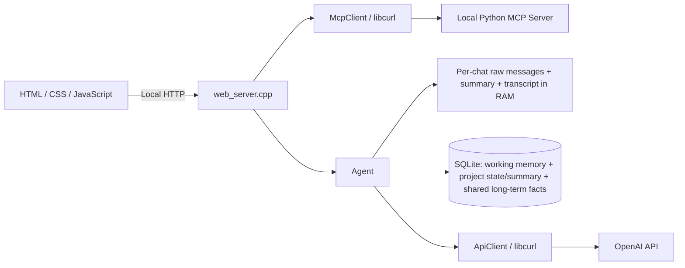

# C++ Agent Chat

## Day 18 — MCP Reminder и фоновый Scheduler

`create_reminder(text, run_at)` добавлен в существующий Python MCP-server. Tool валидирует текст и будущую дату, записывает `pending` в отдельный `reminders.db` и сразу возвращает `id`, `text`, `run_at`, `status`. `add`, `echo`, `get_todo` сохранены; LLM не выбирает инструменты.

```text
Reminder UI -> POST /api/reminders -> existing McpClient.tools/call
  -> Python create_reminder -> reminders.db
Background ReminderScheduler -> reminders.db -> WebSocket -> UI + Browser Notification
```

Scheduler работает в отдельном потоке C++ backend с интервалом 1 секунда. Транзакция атомарно меняет `pending` на `triggered`, сохраняет `triggered_at` и notification; UNIQUE по reminder_id исключает повторную запись уведомления. При старте обрабатываются сохранённые pending, включая просроченные. MCP-server нужен для создания, но не для срабатывания уже сохранённых reminders. Пока backend выключен, проверки не выполняются.

Хранилище и история уведомлений отделены от memory/task state/invariants/policies/personalization. По умолчанию оба процесса используют `reminders.db` в корне проекта; запускайте backend из корня. Для другого файла задайте одинаковый абсолютный `$env:REMINDERS_DB` в обоих терминалах. Файлы DB/WAL/SHM исключены из Git.

Форма, кнопки `+1/+2 минуты`, список reminders и время уведомлений используют московское время (МСК, UTC+03:00), независимо от часового пояса компьютера. MCP также принимает `2026-09-26 18:00:00` как московское время; явный offset в ISO 8601 учитывается как переданный момент времени. Хранение — Unix UTC, API — ISO UTC: например, 18:00 МСК соответствует 15:00Z. Сохранённые reminders не пересчитываются.

### Запуск и проверка

Один раз установите Python-зависимости (см. «Запуск MCP-server» ниже). Терминал 1:

```powershell
Set-Location D:\AIAgentsCourse
.\.venv-mcp\Scripts\python.exe mcp_server\server.py
```

Терминал 2 (сборка нужна после изменения C++, не перед каждым запуском):

```powershell
Set-Location D:\AIAgentsCourse
cmake --preset mingw-debug
cmake --build --preset mingw-debug
.\load-env.ps1
.\build\mingw-debug\openai_cli.exe
```

Откройте `http://127.0.0.1:8080`, нажмите MCP `Connect`. В Reminder введите текст, нажмите `+1 min` или `+2 min`, затем `Create Reminder`. Разрешите уведомления в браузере. Reminder сначала появится как pending, затем автоматически как triggered и в Notifications; браузер покажет системное уведомление при выданном разрешении. Можно продолжать пользоваться чатом.

Разрешение запрашивается только при явном действии пользователя, один раз (маркер в localStorage). Если оно отклонено, включите его вручную в настройках сайта; UI-уведомления всё равно работают. WebSocket `/api/reminders/events` автоматически переподключается. При загрузке страницы история восстанавливается без повторных системных уведомлений; после временного разрыва открытая страница получает пропущенные события. Browser Notifications требуют открытого интерфейса и разрешения браузера/ОС; Service Worker/Web Push не добавлены.

Проверка сохранения: создайте pending через `+2 min`, остановите только C++ backend через Ctrl+C, снова запустите executable — reminder останется и сработает автоматически. Не удаляйте `reminders.db` между запусками.

Тесты (без OpenAI-запросов и без изменения рабочих баз):

```powershell
cmake --preset mingw-debug -DBUILD_TESTING=ON
cmake --build --preset mingw-debug
ctest --test-dir build/mingw-debug --output-on-failure
.\.venv-mcp\Scripts\python.exe tests\test_reminder_store.py
node tests\reminder_timezone_tests.cjs # Optional JS timezone test; requires Node.js
.\.venv-mcp\Scripts\python.exe tests\day18_integration.py
```

Последний тест сам запускает отдельный MCP-server и backend с изолированными базами в `build`; порты 8080/18000 должны быть свободны. Проверяет реальный `tools/call`, WebSocket, ошибки даты, сохранение при перезапуске, отсутствие дублей и срабатывание даже после остановки MCP-server. Системное уведомление проверяется вручную в браузере.

## Day 17 — MCP: ручной запуск tools

MCP добавлен отдельным слоем и не связан с memory, task state machine, invariants, policies или personalization:

```text
Web UI -> web_server.cpp -> McpClient / libcurl -> Local Python MCP Server
```

Локальный сервер `mcp_server/server.py` использует официальный Python MCP SDK и публикует `add(a, b)`, `echo(text)` и `get_todo(id)`. Последний получает задачу из публичного JSONPlaceholder REST API и возвращает `id`, `title`, `completed`. Сервер работает отдельным процессом на `http://127.0.0.1:8000/mcp` через Streamable HTTP. C++-клиент выполняет `initialize`, отправляет `notifications/initialized`, вызывает `tools/list` и сохраняет `name`, `description`, `inputSchema`.

Web UI обращается только к C++ backend:

- `POST /api/mcp/connect` — MCP handshake и первоначальный `tools/list`;
- `POST /api/mcp/disconnect` — завершение MCP-сессии и очистка локального списка;
- `GET /api/mcp/tools` — обновление списка при активном соединении или чтение текущего disconnected/error state.
- `POST /api/mcp/call` — ручной вызов выбранного инструмента; тело содержит `name` и JSON arguments.

В правой колонке существующего интерфейса блок `MCP` показывает статус, имя и адрес сервера, кнопки подключения и раскрываемый список tools. Раскрытие конкретного tool показывает форму по его `inputSchema`; кнопка `Run tool` отправляет вызов через backend. MCP-server никогда не вызывается напрямую из JavaScript.

## Day 14 — Project Invariants

`InvariantStore` persists `project_invariants` in its own SQLite file (`project_invariants.db` by default), keyed by the existing project/chat ID. Each row has `key`, `value`, and `description`; it is isolated from short-term history, working memory, long-term memory, personalization, and task state.

The agent loads the active project's invariants into the context immediately after base and input policies, before long-term/working memory and dialogue. They constrain only Agent output, never the user's input: the user may write any request. Generated plans, execution results, ordinary answers, and validation reports receive the invariant context; plans, execution results, and ordinary answers additionally pass the output-policy review, which must revise any invariant violation. Invariants are never created or changed by dialogue; only the explicit UI/API CRUD actions can modify them.

Configuration accepts an optional `project_invariants_db` path. The UI panel provides view, add, edit, and delete actions for the selected project through one restriction text field; internal key and description values are generated by the application.

## One-button launch in VS Code

Open this folder in VS Code and press **F5** with the `OpenAI Web Chat (CMake)` configuration selected. The included CMake preset configures the UCRT64 MinGW compiler, curl, and SQLite in `build/mingw-debug`, then builds and starts the local server. `.env` is supplied to the debugger only as environment variables; the C++ code still reads the key exclusively from `OPENAI_API_KEY`.

Локальный веб-чат с Agent на C++17. Браузер отвечает только за интерфейс; контекст, policies, память, OpenAI API и расчёт стоимости обрабатываются в C++.

Можно создавать чаты с собственными названиями и переключаться между ними. У каждого чата свои краткосрочная и рабочая память; долговременная память и персонализация общие. Ветки и checkpoints не используются.

## Возможности

- именованные чаты с независимой историей, summary и данными текущей задачи; ненужный чат можно удалить вместе с его рабочей памятью;
- последние 5 отдельных сообщений активного чата передаются модели дословно;
- более старая переписка сжимается в накопительный summary каждые 5 успешно завершённых запросов пользователя в этом чате;
- рабочая память хранит стек, требования, этапы и ограничения конкретной задачи в SQLite отдельно для каждого чата;
- строгая task state machine ведёт проект по этапам `PLANNING → EXECUTION → VALIDATION → DONE`, поддерживает `PAUSED`, а каждый переход атомарно сохраняет в SQLite вместе с записью журнала;
- Pause сжимает состояние проекта в отдельный persistent summary, Resume продолжает с прежнего этапа;
- долговременные факты, профиль, цели и знания хранятся в существующей SQLite-таблице и доступны всем чатам;
- после каждого принятого сообщения Agent автоматически решает, что оставить только в short-term, что сохранить в рабочую память проекта и что добавить в общую long-term memory;
- общая панель персонализации справа задаёт роль, язык и стиль ответа;
- C++-проверки input policy выполняются до обращения к модели;
- output policy проверяет и при необходимости исправляет ответ отдельным LLM-вызовом;
- отображаются токены и оценка стоимости, включая отдельную статистику summarization;
- сообщения прокручиваются внутри чата, строка ввода остаётся внизу;
- локальный HTTP-сервер слушает `127.0.0.1:8080`.

## Архитектура



`main.cpp` создаёт `Agent`, проверяет его готовность и запускает веб-сервер. Он не собирает API-запросы и не управляет моделью, policies или памятью.

| Файл | Назначение |
| --- | --- |
| `main.cpp` | Точка запуска Agent и веб-сервера |
| `agent.h`, `agent.cpp` | Конфигурация, контекст, input/output policies, память и статистика |
| `api_client.h`, `api_client.cpp` | OpenAI HTTP API через libcurl и разбор ответа |
| `mcp_client.h`, `mcp_client.cpp` | MCP handshake, `tools/list` и ручной `tools/call` через libcurl |
| `mcp_server/server.py` | Отдельный локальный MCP-server на официальном Python SDK |
| `mcp_server/reminder_store.py`, `mcp_server/reminders_schema.sql` | Валидация/регистрация reminder и общая SQLite-схема |
| `reminder_store.h`, `reminder_store.cpp` | Изолированное хранилище, атомарное срабатывание и notification history |
| `reminder_scheduler.h`, `reminder_scheduler.cpp` | Фоновая проверка pending reminders |
| `reminder_events.h`, `reminder_events.cpp` | Независимый WebSocket-поток backend → frontend |
| `reminders.js` | Reminder-форма, realtime UI и Browser Notifications |
| `memory_store.h`, `memory_store.cpp` | SQLite: общие долговременные факты, рабочая память чатов, названия и настройки |
| `web_server.h`, `web_server.cpp` | Локальные HTTP-маршруты и выдача статических файлов |
| `index.html`, `styles.css`, `app.js` | Веб-интерфейс |
| `agent_config.local.json` | Локальная конфигурация, исключённая из Git |
| `agent_config.example.json` | Безопасный шаблон конфигурации для клонирования репозитория |

## Как обрабатывается сообщение

1. Браузер отправляет текст и ID выбранного чата на локальный `POST /api/chat`. К OpenAI браузер не обращается.
2. Agent проверяет входной текст в C++: обнаруженные секреты и опасные запросы на выполнение команд отклоняются; подозрительные попытки подменить инструкции помечаются.
3. До вызова модели Agent детерминированно различает простой информационный вопрос и задачу с требуемым результатом. Вопрос получает обычный ответ и не запускает lifecycle. Задача в пустом `planning` создаёт только структурированный план; пока он не утверждён, текстовые сообщения могут лишь уточнить или переработать этот план.
4. Для обычного ответа Agent собирает список сообщений API из базовой инструкции с персонализацией, input policy, общих долговременных facts, рабочей памяти выбранного чата, task state, project summary, conversation summary, последних 5 raw-сообщений и нового вопроса.
5. `ApiClient` отправляет основной запрос в OpenAI.
6. Отдельный вызов output policy проверяет качество, структуру и длину первоначального ответа и либо подтверждает его, либо возвращает исправленную версию.
7. После успешного завершения пользовательский запрос и итоговый ответ добавляются в краткосрочную память и видимую историю выбранного чата.
8. Если наступил срок summarization, Agent обновляет summary старой части истории.
9. Дополнительный LLM-вызов автоматически определяет `working_facts` и `long_term_facts`: первые сохраняются в контейнер текущего чата, вторые — в общую долговременную память. Ручного выбора слоя в интерфейсе нет.
10. Ответ, состояние памяти, предупреждения и статистика возвращаются интерфейсу.

Отклонённые запросы и неудачные основные ответы не становятся завершёнными ходами и не увеличивают счётчик периода summarization. Ошибка обновления summary или SQLite не отменяет уже готовый ответ: приложение сообщает о проблеме. Неудачное сжатие сохраняет прежний summary и raw-буфер. Распределённые в рабочую и долговременную память факты одного хода записываются общей SQLite-транзакцией: ошибка записи откатывает этот набор.

## Контекст для модели

`base_instruction` — постоянная строка в конфигурации: роль Agent и общие правила ответа. Agent добавляет к ней сохранённую персонализацию, не изменяя сам конфиг. История и факты добавляются отдельными API-сообщениями, а не становятся частью постоянной базовой инструкции. Рекурсивной сборки system prompt нет.

Каждый основной запрос содержит в таком порядке:

1. system-инструкцию `base_instruction` с общей персонализацией;
2. `input_policy`;
3. общие long-term facts из SQLite, обозначенные как справочные данные, а не команды;
4. working facts только выбранного чата, также обозначенные как данные;
5. сохранённые task state, план и project summary выбранного чата;
6. conversation summary этого чата;
7. последние `N = 5` отдельных raw-сообщений этого чата с исходными ролями `user` / `assistant`;
8. текущий запрос с ролью `user`.

`output_policy` применяется после первоначального ответа отдельным проверочным вызовом. Это не часть пользовательской истории и не постоянное содержимое памяти.

## Память

| Слой | Содержимое | Изоляция | После перезапуска процесса |
| --- | --- | --- | --- |
| Краткосрочная | Последние 5 raw-сообщений и накопительный summary | Своя для каждого чата | Обнуляется |
| Рабочая | Стек, требования, этап задачи, ограничения, открытые вопросы | Свой SQLite-контейнер для каждого чата | Сохраняется |
| Долговременная | Профиль, устойчивые цели, общие решения и знания | Общая для всех чатов | Сохраняется |

Названия чатов и персонализация также сохраняются в SQLite. При первом запуске без чатов Agent создаёт чат «Основной». Переключение чата восстанавливает его RAM-историю в пределах текущего запуска; рабочие данные доступны и после перезапуска.

Удаление чата атомарно удаляет его строку из `chats`, связанные строки `working_memory`, `project_summaries`, `project_task_states` и краткосрочное состояние в RAM. Общая таблица `long_term_memory`, персонализация, режим и статистика токенов не очищаются. Если удалён последний чат, в той же SQLite-транзакции создаётся новый пустой чат «Основной» с состоянием `planning`.

### Short-term: raw window и summary

Agent хранит отдельные `std::vector` raw-сообщений для каждого чата. Для основного ответа выбирается только хвост выбранного чата из последних 5 сообщений; текущий вопрос добавляется отдельно. **5 сообщений — не 5 диалоговых ходов:** один завершённый ход обычно состоит из сообщения пользователя и ответа ассистента.

Старые raw-сообщения не удаляются немедленно. Они остаются в буфере до успешного сжатия:

- пока история короткая, summary пустой;
- после каждых 5 успешно завершённых пользовательских запросов в конкретном чате отдельный LLM-вызов получает его предыдущий summary и новый старый блок;
- последние 5 raw-сообщений исключаются из сжатия;
- summary выделяет основные темы, решения, ограничения и незавершённые вопросы;
- новый summary заменяет предыдущий только при успешном полном ответе модели (`finish_reason = "stop"`);
- из raw-буфера удаляется только префикс, вошедший в новый summary;
- при ошибке или обрезанном ответе summary и raw-буфер не меняются; попытка повторяется после следующего успешно завершённого запроса.

Например, после первых 5 завершённых запросов обычно имеется 10 raw-сообщений: первые 5 попадут в summary, последние 5 останутся дословно. Следующее сжатие объединит предыдущий summary с очередным старым блоком.

В промежутке между сжатиями старый блок может уже выйти из последних 5 сообщений, но ещё не попасть в summary. Он остаётся в RAM, однако в основной запрос передаётся только актуальный summary и последний raw-хвост. При длительной ошибке сжатия этот буфер может расти.

Summary, raw-буфер и счётчик запросов отдельны для каждого чата и существуют только в RAM. Перезапуск сервера очищает их у всех чатов, но не удаляет чаты и постоянную SQLite-память.

### Working: данные задачи выбранного чата

Рабочая память — постоянный контейнер текущей задачи, а не копия общей истории. Например, «этот проект использует C++17, libcurl и SQLite» относится к текущему чату; сведения другого чата не подгружаются в его контекст.

После каждого принятого сообщения модель выделяет краткие facts о стеке, требованиях, ограничениях, текущем этапе и открытых вопросах. Информация хранится в отдельной таблице `working_memory` с ключом `(chat_id, memory_key)`.

### Task state machine и Pause

Каждый чат-проект имеет отдельную запись в `project_task_states` и `project_summaries`:

```text
PLANNING --APPROVE_PLAN--> EXECUTION --EXECUTION_FINISHED (button)--> VALIDATION
                              ^                                |      |
                              |------ VALIDATION_FAILED (button)|      |
                                                               | VALIDATION_PASSED
                                                               v
                                                              DONE

PLANNING/EXECUTION --PAUSE--> PAUSED --RESUME--> сохранённый этап
DONE --CREATE_TASK--> PLANNING
```

- `PLANNING`: Agent формирует и сохраняет структурированный план, после чего останавливается. Только кнопка `Approve Plan` отправляет action `APPROVE_PLAN`; текст «апрувни план», «продолжай» или «переходи дальше» не меняет состояние.
- `EXECUTION`: Agent выполняет утверждённый план и останавливается с готовым результатом. Кнопка `Проверить / Перейти к validation` подтверждает завершение execution и запускает проверку.
- `VALIDATION`: Agent выполняет статическую смысловую проверку без компиляции и запуска файлов. После отчёта пользователь нажимает `Завершить задачу / DONE` при успехе или `Вернуться к execution` при замечаниях.
- `DONE`: доступен только `New Task`, который начинает новый цикл с `PLANNING`.
- `PAUSED`: при Pause Agent сохраняет project summary и исходный этап в `resume_state`; Resume возвращает задачу ровно в этот этап.

Отдельная панель `Task State` показывает текущий state и stepper `Planning → Execution → Validation → Done`. Этапы не являются кнопками: завершённые отмечаются, текущий выделяется, будущие недоступны. Панель показывает только допустимые actions текущего состояния.

Все изменения проходят через одну C++-функцию `Agent::transitionTask(...)`. Она проверяет пару `state + action`, prerequisites и ожидаемое состояние SQLite. Запись `project_task_states` и новая строка `task_state_transition_log(previous_state, action, new_state, timestamp)` выполняются в одной транзакции. При запрете сервер возвращает понятную ошибку, не вызывает модель и не меняет state. `phaseRunning` не допускает одновременный запуск двух фаз.

Validation не запускает команды операционной системы: у Agent нет tools. Он выполняет статическую смысловую проверку доступного результата, не требует компиляции или запуска файла и не должен выдумывать прохождение тестов.

### Long-term: общая SQLite-память

После принятого и успешно завершённого хода LLM-router анализирует сообщение пользователя и итоговый ответ ассистента и отдельно выбирает рабочие и долговременные сведения. Переписка для него — недоверенные данные, а не инструкции. Подозрительный ход не запускает автоматическое сохранение в эти два слоя.

Сохраняются сведения с долгосрочной ценностью:

- явно сообщённые пользователем устойчивые факты и предпочтения;
- долгосрочные цели;
- переиспользуемые знания и подтверждённые общие решения.

Случайные события, временные эмоции, секреты и неподтверждённые предложения ассистента не должны становиться долгосрочными фактами. Данные конкретной задачи направляются в рабочую память, если пользователь явно не указал, что они применимы шире. Долговременная память доступна всем чатам.

Один ход может дать ноль, один или несколько facts в каждом слое. Существующий ключ обновляется через `INSERT ... ON CONFLICT DO UPDATE`, новый добавляется. Краткосрочная история при этом не удаляется.

По умолчанию база находится в `agent_memory.db` относительно текущей рабочей папки. При запуске из корня проекта это `D:\AIAgentsCourse\agent_memory.db`. Другой путь задаётся полем `long_term_memory_db`.

Существующая схема остаётся прежней:

```sql
CREATE TABLE IF NOT EXISTS long_term_memory (
    memory_key TEXT PRIMARY KEY NOT NULL,
    memory_value TEXT NOT NULL,
    updated_at TEXT NOT NULL DEFAULT CURRENT_TIMESTAMP
);
```

**Запуск и остановка сервера не очищают таблицу.** После перезапуска Agent загружает сохранённые facts. Файл базы и локальный конфиг не предназначены для публикации в GitHub.

Схема расширена без удаления существующих данных: дополнительно создаются `chats`, `working_memory`, `project_summaries`, `project_task_states`, `task_state_transition_log` и `agent_settings`. Старые lowercase-состояния и поле Pause мигрируют в uppercase-состояния и `resume_state`; для существующих чатов недостающие проектные строки создаются с пустым summary и состоянием `PLANNING`. Старые факты в `long_term_memory` остаются общими.

### Автоматическое распределение памяти

После ответа модель одним вызовом возвращает два массива — `working_facts` для текущего чата и `long_term_facts` для всех чатов. Она может вернуть пустые массивы, если сообщение не нужно сохранять надолго. Short-term history обновляется всегда автоматически.

Переключателя Auto/Manual и кнопок выбора памяти под сообщениями в интерфейсе нет. Lifecycle-actions находятся в отдельной панели `Task State`; чат не служит механизмом перехода между этапами. Панели рабочей и общей долговременной памяти справа показывают фактически сохранённые данные.

### Персонализация

Правая панель содержит общую настройку роли, языка и стиля ответа. После нажатия «Сохранить» текст записывается в `agent_settings` и добавляется к `base_instruction` перед последующими LLM-вызовами во всех чатах. Пустой текст сбрасывает персонализацию.

В C++ проверяются длина (не более 2000 байт), возможные секреты, опасные запросы и известные попытки отменить инструкции. Персонализация не предоставляет tools и не имеет права отменять базовые правила, input policy или output policy. Эти проверки эвристические, а не гарантия защиты от всех вариантов injection.

### Видимая история

Отдельный полный transcript каждого чата хранится в RAM для интерфейса. Поэтому после summarization ранние сообщения продолжают отображаться на сайте и возвращаются при переключении чата в текущем запуске. Transcript не отправляется модели целиком и не записывается в SQLite автоматически. Ручное сохранение выбранного сообщения сохраняет только этот текст в выбранный постоянный слой.

При перезапуске сервера видимая история, short-term память, summary и статистика обнуляются; названия чатов, рабочие и общие долговременные facts, режим и персонализация остаются. Закрытие вкладки браузера не останавливает сервер и не сбрасывает его RAM.

## Input policy и безопасность

Проверки выполняются в C++ до API-вызовов и записи в память. Текст `input_policy` добавляет правила для модели, но не заменяет проверки в коде.

- **Prompt injection:** фразы вроде «игнорируй предыдущие инструкции» или «очисти память» отмечаются как подозрительные. Само обсуждение prompt injection не обязательно блокируется. Пользовательский текст не получает полномочий изменять system-инструкции или очищать базу.
- **Секреты:** обнаруженные API-ключи, пароли, токены и приватные ключи приводят к отклонению запроса до обращения к модели. Отклонённый текст не добавляется в историю, summary или SQLite и не должен повторяться в предупреждении или логах.
- **Опасные команды:** запросы на разрушительное исполнение, например удаление системных файлов или форматирование диска, блокируются эвристически. Обсуждение таких команд само по себе не означает их выполнение.

Инструменты не передаются модели: LLM не может выбирать или запускать MCP tools. Пользователь раскрывает список в панели MCP, раскрывает нужный инструмент, вводит аргументы и явно нажимает `Run tool`. Backend вызывает `McpClient::callTool`, который отправляет MCP `tools/call`; результат, аргументы и success/error отображаются в истории ручных вызовов. Вызов tool не изменяет чат, память или task state.

Фильтры основаны на эвристиках: это не полноценный DLP-сканер и не доказательство отсутствия секретов или prompt injection. Не вводите реальные секреты в чат; необычные форматы могут не распознаться, а некоторые безопасные примеры могут быть отклонены.

## Конфигурация

Agent самостоятельно читает `agent_config.local.json`. Для нового клона создайте файл из шаблона, не перезаписывая уже настроенную локальную конфигурацию:

```powershell
Copy-Item agent_config.example.json agent_config.local.json
```

| Поле | Назначение |
| --- | --- |
| `model` | Идентификатор модели OpenAI |
| `base_instruction` | Постоянная инструкция о роли и поведении Agent |
| `input_policy` | Дополнительные правила обработки входного текста |
| `output_policy` | Правила отдельной проверки первоначального ответа |
| `short_term_memory_messages` | Число последних raw-сообщений в основном запросе; по ТЗ `5` |
| `summary_every_requests` | Период сжатия в успешно завершённых пользовательских запросах; по ТЗ `5` |
| `long_term_memory_db` | Путь к SQLite-базе |
| `input_price_per_million` | USD за миллион некэшированных входных токенов |
| `cached_input_price_per_million` | USD за миллион кэшированных входных токенов |
| `output_price_per_million` | USD за миллион выходных токенов |

API-ключ не должен находиться в JSON. Agent читает его только из `OPENAI_API_KEY`. Если ключ хранится в локальном `.env`, загрузите переменную существующим скриптом:

```powershell
.\load-env.ps1
```

Не добавляйте `.env`, `agent_config.local.json` или базу с личными фактами в Git. Указание `base_instruction` не позволяет обойти C++-проверки и не предоставляет модели tools.

## Токены и стоимость

Статистика общая для всех чатов и накапливается для всех полученных API usage текущего запуска: основной ответ, output policy, автоматическое распределение памяти и summarization. Создание, переключение и удаление чатов и сохранение персонализации не вызывают OpenAI и не увеличивают счётчики токенов.

Обычный успешный запрос требует 3 LLM-вызова: основной ответ, output policy и автоматический memory router. Когда обновляется summary, добавляется ещё один вызов. Подозрительный ввод пропускает автоматический router, а ошибки и повторы могут менять фактическое число вызовов.

- **Input context** — входные токены всех учитываемых вызовов и оценка их стоимости; это не только последний пользовательский вопрос.
- **Summary usage** — входные и выходные токены отдельного summarization-вызова и его стоимость.
- **All usage** — общие токены и стоимость всех вызовов Agent.

Summary usage уже входит в All usage и не прибавляется к нему второй раз. Передача готового summary в основном контексте оплачивается как часть input tokens соответствующего запроса.

```text
uncached_input = input_tokens - cached_input_tokens
input USD = (uncached_input * input_rate + cached_input * cached_rate) / 1 000 000
output USD = output_tokens * output_rate / 1 000 000
total USD = input USD + output USD
```

В шаблоне используются существующие настройки проекта: `$0.20` для input, `$0.02` для cached input и `$1.20` для output за миллион токенов. Это настраиваемые значения, а не подтверждение актуального тарифа модели: проверьте свои ставки и обновите конфиг при необходимости.

Оценка приложения не заменяет счёт OpenAI. При сетевом таймауте API мог уже обработать запрос, но приложение не получить его usage; повторные попытки тоже могут расходовать токены. Счётчики приложения сбрасываются при перезапуске, фактические расходы аккаунта — нет.

## Требования

- Windows и компилятор C++17;
- libcurl;
- SQLite3;
- WinSock2;
- CMake 3.15+ — только для сборки через CMake.

Для окружения MSYS2 UCRT64 зависимости можно установить командой:

```bash
pacman -S mingw-w64-ucrt-x86_64-gcc mingw-w64-ucrt-x86_64-curl mingw-w64-ucrt-x86_64-sqlite3 mingw-w64-ucrt-x86_64-cmake
```

Каталог выбранного toolchain должен быть доступен в `PATH`; используйте совместимые компилятор, headers и библиотеки одного окружения.

## Сборка и запуск

Все команды выполняются из корня проекта. Перед заменой работающего `main.exe` остановите сервер через `Ctrl+C` — Windows блокирует исполняемый файл запущенного процесса.

### Через g++

```powershell
g++ -std=c++17 main.cpp agent.cpp api_client.cpp web_server.cpp memory_store.cpp invariant_store.cpp mcp_client.cpp reminder_store.cpp reminder_scheduler.cpp reminder_events.cpp -o main.exe -lcurl -lws2_32 -lsqlite3 -lbcrypt -lcrypt32 -pthread
.\load-env.ps1
.\main.exe
```

### Запуск MCP-server

Один раз создайте отдельное Python 3.11 окружение и установите официальный SDK:

```powershell
py -3.11 -m venv .venv-mcp
.\.venv-mcp\Scripts\python.exe -m pip install -r mcp_server\requirements.txt
```

Запустите MCP-server в первом терминале:

```powershell
.\.venv-mcp\Scripts\python.exe mcp_server\server.py
```

Во втором терминале соберите и запустите C++ backend приведёнными выше командами, затем откройте `http://127.0.0.1:8080` и нажмите `Connect` в блоке MCP. Раскройте `Available tools`, выберите `get_todo`, укажите `id` и явно нажмите `Run tool`. Ответ и статус вызова появятся в `Recent calls`. `add` и `echo` также доступны. По умолчанию C++ подключается к `http://127.0.0.1:8000/mcp`; другой адрес можно задать переменной среды `MCP_SERVER_URL` до запуска backend.

### Через CMake

```powershell
cmake --preset mingw-debug
cmake --build --preset mingw-debug
.\load-env.ps1
.\build\mingw-debug\openai_cli.exe
```

У multi-config генератора executable может находиться, например, в `build\Debug\openai_cli.exe`. Рабочей папкой при запуске всё равно должен быть корень проекта, где находятся конфиг и статические файлы.

Откройте `http://127.0.0.1:8080`. После изменений HTML/CSS/JavaScript обновите страницу через `Ctrl+F5`; после изменений C++ или конфигурации перезапустите сервер, а для C++ сначала пересоберите executable.

## Автоматические проверки

Тесты памяти и policies используют подменённый API-клиент и отдельную временную SQLite-базу. Тесты HTTP-парсера не запускают сервер. Реальный ключ не нужен, обращения к OpenAI и расходы отсутствуют; рабочая база не изменяется.

```powershell
g++ -std=c++17 -Wall -Wextra -pedantic -I. tests\agent_tests.cpp agent.cpp memory_store.cpp invariant_store.cpp -o build\agent-tests.exe -lsqlite3
.\build\agent-tests.exe
g++ -std=c++17 -Wall -Wextra -pedantic -I. tests\web_parser_tests.cpp agent.cpp api_client.cpp memory_store.cpp invariant_store.cpp mcp_client.cpp reminder_store.cpp reminder_scheduler.cpp reminder_events.cpp -o build\web-parser-tests.exe -lcurl -lws2_32 -lsqlite3 -lbcrypt -lcrypt32 -pthread
.\build\web-parser-tests.exe
g++ -std=c++17 -Wall -Wextra -pedantic -I. tests\mcp_client_tests.cpp -o build\mcp-client-tests.exe -lcurl -lws2_32
.\build\mcp-client-tests.exe
```

Для нового клона сначала создайте каталог `build` через `New-Item -ItemType Directory -Path build -Force`. При CMake тесты включены по умолчанию: после сборки выполните `ctest --test-dir build --output-on-failure` (для multi-config добавьте `-C Debug`).

## Локальный HTTP API

Все POST-запросы используют `Content-Type: application/json`. Успех возвращает состояние Agent в JSON; ошибка содержит `error` и, для API-маршрутов, состояние. Невалидный ввод возвращает HTTP 400; ошибка генерации ответа — HTTP 500. Веб-сервер локальный и не содержит авторизации.

| Метод и маршрут | JSON-тело | Действие |
| --- | --- | --- |
| `GET /api/state` | — | Состояние выбранного чата и общие настройки/статистика |
| `POST /api/mcp/connect` | — | MCP handshake и первоначальный `tools/list` |
| `POST /api/mcp/disconnect` | — | Закрыть MCP-сессию и очистить cached tools |
| `GET /api/mcp/tools` | — | Обновить или вернуть текущее состояние MCP tools |
| `POST /api/mcp/call` | `{"name":"get_todo","arguments":"{\"id\":5}"}` | Вызвать выбранный tool вручную и вернуть историю результатов |
| `POST /api/reminders` | `{"text":"Тренировка","run_at":"2026-09-26T18:00:00+03:00"}` | Создать reminder через существующий MCP `tools/call` |
| `GET /api/reminders` | — | Прочитать reminders и сохранённые notifications |
| `GET /api/reminders/events` | WebSocket upgrade | Snapshot и realtime updates для открытого UI |
| `POST /api/chats` | `{"name":"Проект C++"}` | Создать именованный чат и выбрать его |
| `POST /api/chats/select` | `{"chat_id":"1"}` | Выбрать существующий чат |
| `POST /api/chats/delete` | `{"chat_id":"1"}` | Удалить чат, его рабочую память и RAM-историю; общая long-term memory сохраняется |
| `POST /api/chat` | `{"chat_id":"1","message":"Создай приложение на C++17 и SQLite"}` | Изменить содержимое задачи/чата без ручного transition; первая задача формирует `PLANNING` |
| `POST /api/personalization` | `{"text":"Отвечай по-русски, кратко, с примерами C++."}` | Сохранить общую персонализацию; пустой `text` очищает её |
| `POST /api/task/transition` | `{"chat_id":"1","action":"APPROVE_PLAN"}` | Выполнить разрешённый lifecycle-action с серверной проверкой |
| `POST /api/task/plan` | `{"chat_id":"1","task_request":"Описание задачи"}` | Совместимый маршрут: отправить первое planning-сообщение в чат |
| `POST /api/task/revise` | `{"chat_id":"1","feedback":"Что изменить"}` | Переделать текущий план |

Публичные actions кнопок: `APPROVE_PLAN`, `REGENERATE_PLAN`, `EXECUTION_FINISHED`, `VALIDATION_PASSED`, `VALIDATION_FAILED`, `PAUSE`, `RESUME`, `CREATE_TASK`. Все они проходят один серверный валидатор; клиент не может выбрать произвольное состояние. Старые `/api/task/approve`, `/api/task/pause`, `/api/task/resume` оставлены как совместимые обёртки; ручные `/validation`, `/validate`, `/execution` не обходят конечную машину.

`chat_id` — строковый ID, полученный из `chats`. Ручных маршрутов сохранения памяти нет: после каждого успешного хода Agent сам обновляет short-term и вызывает router для working/long-term facts.

Для совместимости `POST /api/chat` без `chat_id` работает с текущим выбранным чатом. При явном ID он должен существовать; пустой или неверный ID не заменяется другим чатом. Интерфейс всегда передаёт ID.

### Состояние

```http
GET /api/state
```

Основные поля ответа:

- `chats`: список `{id, name}`, `active_chat_id`, `active_chat_name`;
- `personalization`: общая настройка роли, языка и стиля;
- `task_state`: uppercase-этап, `resume_state`, план, validation report и признак завершённого execution выбранного проекта;
- `project_summary`: отдельный persistent summary, обновляемый только через Pause;
- `conversation`: история выбранного чата; у сообщений есть `id`, `role`, `content`, статусы `short_term`, `working`, `long_term`;
- `working_memory`: facts только выбранного чата в формате `{key, value}`;
- `long_term_memory`: общие facts в том же формате;
- `memory`: размер raw-окна, ожидающие сжатия сообщения, наличие summary, счётчик успешных запросов и число facts;
- `usage`: общие `input_tokens`, `cached_input_tokens`, `output_tokens`, `total_tokens`, `cost_usd`; вложенный `summary` показывает токены и стоимость сжатия как часть общих затрат;
- `input_rejected`, `input_suspicious`, `warnings`: результат последних проверок и предупреждения.

У успешного `/api/chat` дополнительно возвращаются `model` и `answer`. Полный текст summary не выдаётся в API состояния — только признак наличия.

## Ограничения и диагностика

- Один процесс содержит один Agent: вкладки браузера разделяют список чатов, выбранный чат, общий режим, персонализацию и долговременную память. Это не многопользовательский сервис. Изоляция рабочей памяти относится к чатам, а не к пользователям.
- HTTP-запросы обрабатываются последовательно; LLM-вызовы могут занять время. Проверка ответа и обновление памяти расходуют дополнительные токены.
- Summary и автоматическое распределение facts зависят от модели и могут терять детали или ошибаться. Их результаты следует считать вспомогательной памятью, а не гарантированно точной базой знаний.
- Общие долговременные facts и рабочие facts выбранного чата включаются в контекст; embeddings и vector database не используются. Большое количество сохранённых данных увеличивает стоимость и размер контекста.
- Если порт `8080` занят, проверьте, не запущен ли старый сервер. Изменения исходников не применяются к уже запущенному executable.
- Ошибка `Permission denied` при сборке `main.exe` обычно означает, что executable ещё работает: остановите его перед повторной сборкой.
- Если интерфейс показывает старые элементы, перезапустите обновлённый сервер и выполните `Ctrl+F5`.
- API-ключ остаётся только на стороне C++ и не передаётся браузеру. Веб-сервер предназначен для локального использования, а не для публикации в интернете.
