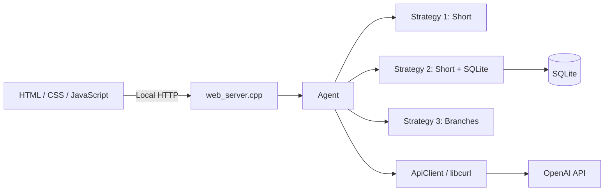

# C++ Agent Chat

Локальный веб-чат с Agent, написанным на C++17. Браузер отвечает только за интерфейс, а формирование контекста, стратегии памяти, SQLite, policies, вызовы OpenAI API и статистика выполняются на стороне C++.

## Возможности

- три переключаемые стратегии памяти;
- независимый контекст каждой стратегии;
- sliding window на 10 сообщений;
- long-term memory в SQLite для стратегии 2;
- автоматические checkpoints и изолированные ветки для стратегии 3;
- input policy и output policy;
- подсчёт input, cached input, output и total tokens;
- оценка стоимости в долларах;
- локальный HTTP-сервер на `127.0.0.1:8080`.

## Архитектура



`main.cpp` только создаёт `Agent` и запускает веб-сервер. Он не знает о модели, policies, памяти, SQLite или деталях OpenAI API.

## Стратегии памяти

### 1. Short

- Используются только последние 10 сообщений: 5 пар `user + assistant`.
- История хранится в `std::vector` и работает как sliding window.
- SQLite не читается и не обновляется.
- Summary не создаётся и не используется.

### 2. SQLite

- Есть собственные последние 10 сообщений, независимые от стратегии 1.
- Перед основным ответом Agent анализирует новое сообщение пользователя.
- В SQLite сохраняются устойчивые сведения о пользователе, долгосрочные цели, важные факты проекта, выбранные решения, ограничения, обязательства и важные незавершённые задачи.
- Случайные события, small talk, временные эмоции и секреты не сохраняются.
- Загруженные SQLite facts добавляются к system-контексту каждого запроса этой стратегии.

Long-term extractor используется только в стратегии 2. SQLite хранит факты в течение текущего запуска сервера и очищается при его завершении.

### 3. Branch

- Стратегия имеет собственную память и не использует SQLite.
- Каждый запрос в основной линии Strategy 3 передаётся специальному LLM-вызову, который проверяет, можно ли дать два существенно разных ответа: например, `за/против`, два архитектурных подхода или два независимых способа решения.
- Если разделение возможно, checkpoint становится сам текущий запрос пользователя.
- Обычные списки, примеры и совместимые шаги не должны создавать checkpoint.
- При checkpoint создаются ровно две ветки с короткими названиями и двумя готовыми вариантами ответа.
- Первая ветка открывается автоматически, а на сайте появляются ровно два переключателя ответов.
- Каждая новая ветка получает снимок последних 10 сообщений до checkpoint, текущий запрос, свой ответ и собственное направление.
- Последующие сообщения ветки хранятся отдельно. Ветка не видит сообщения sibling-веток.
- Ветви можно переключать на сайте; их контекст и история восстанавливаются.
- Внутри ветки новые checkpoints запрещены: дальнейшие запросы продолжают только выбранную ветку.

Ветки и checkpoints существуют только в RAM и исчезают после завершения процесса.

## Переключение стратегий

В верхней панели сайта доступны кнопки:

- `1 Short`;
- `2 SQLite`;
- `3 Branch`.

При переходе с одной стратегии на другую окно чата показывает историю выбранной стратегии. Например, при переходе `1 → 3` пользователь увидит отдельный пустой branch-чат, а при возврате `3 → 1` снова увидит прежний контекст стратегии 1.

Один процесс сервера содержит один Agent. Поэтому открытые вкладки браузера используют общее состояние и синхронизируются при возврате фокуса.

## Обработка сообщения

Для каждого пользовательского запроса Agent выполняет:

1. выбирает память активной стратегии;
2. в стратегии 2 запускает расширенный long-term extractor и обновляет SQLite;
3. формирует контекст из input policy, разрешённой памяти и текущего запроса;
4. отправляет основной запрос через `ApiClient`;
5. применяет существующую output policy;
6. сохраняет завершённую пару сообщений в short-term memory активной стратегии;
7. в основной линии стратегии 3 проверяет текущий запрос на возможность двух ответов и при необходимости создаёт checkpoint;
8. возвращает ответ и обновлённое состояние веб-интерфейсу.

## Файлы

| Файл | Назначение |
| --- | --- |
| `main.cpp` | Запуск Agent и веб-сервера |
| `agent.h`, `agent.cpp` | Все стратегии, контекст, policies, память, branching и статистика |
| `api_client.h`, `api_client.cpp` | OpenAI HTTP API через libcurl и разбор ответа |
| `memory_store.h`, `memory_store.cpp` | SQLite-хранилище стратегии 2 |
| `web_server.h`, `web_server.cpp` | Локальные HTTP-маршруты и статические файлы |
| `index.html`, `styles.css`, `app.js` | Веб-интерфейс |
| `agent_config.local.json` | Локальная конфигурация, исключённая из Git |
| `agent_config.example.json` | Безопасный шаблон конфигурации для GitHub |

## Конфигурация

Создайте локальный файл из шаблона:

```powershell
Copy-Item agent_config.example.json agent_config.local.json
```

Пример:

```json
{
  "model": "gpt-5.6-luna",
  "input_price_per_million": 0.20,
  "cached_input_price_per_million": 0.02,
  "output_price_per_million": 1.20,
  "input_policy": "",
  "output_policy": "Check the initial answer for quality, clear structure, and appropriate length for the user's request. If it does not meet these requirements, correct it before returning it.",
  "short_term_memory_messages": 10,
  "long_term_memory_db": "agent_memory.db"
}
```

`short_term_memory_messages` задаёт количество предыдущих raw-сообщений, доступных каждой short-term памяти. Значение `10` соответствует пяти завершённым диалоговым ходам.

API-ключ в JSON не хранится. Agent читает его только из переменной окружения:

```powershell
$env:OPENAI_API_KEY = "your-key"
```

Если ключ находится в локальном `.env`, загрузите его существующим скриптом:

```powershell
.\load-env.ps1
```

## SQLite

По умолчанию база расположена здесь:

```text
agent_memory.db
```

Путь задаётся полем `long_term_memory_db`. Таблица создаётся автоматически:

```sql
CREATE TABLE IF NOT EXISTS long_term_memory (
    memory_key TEXT PRIMARY KEY NOT NULL,
    memory_value TEXT NOT NULL,
    updated_at TEXT NOT NULL DEFAULT CURRENT_TIMESTAMP
);
```

Факты записываются через `INSERT ... ON CONFLICT DO UPDATE`. При штатной остановке сервера через `Ctrl+C` Agent удаляет все строки из таблицы. При следующем запуске таблица также очищается, поэтому данные не сохранятся даже после предыдущего аварийного завершения. Сам файл `.db` остаётся на диске, но память внутри него пуста.

## Токены и стоимость

Статистика накапливается для всех LLM-вызовов текущего процесса: основной ответ, output policy, SQLite extractor и branch detector.

```text
input USD = (uncached_input × input_rate + cached_input × cached_rate) / 1 000 000
output USD = output_tokens × output_rate / 1 000 000
total USD = input USD + output USD
```

Ставки находятся в локальном конфиге. Это диагностическая оценка, а не официальный счёт: при изменении тарифов конфиг нужно обновить; при сетевом таймауте приложение может не получить API usage уже обработанного запроса.

Статистика и стоимость обнуляются при перезапуске приложения.

## Требования

- Windows;
- компилятор C++17;
- libcurl;
- SQLite3;
- WinSock2;
- CMake 3.15+ — только для сборки через CMake.

Для MSYS2 UCRT64:

```bash
pacman -S mingw-w64-ucrt-x86_64-gcc mingw-w64-ucrt-x86_64-curl mingw-w64-ucrt-x86_64-sqlite3 mingw-w64-ucrt-x86_64-cmake
```

## Сборка

### Напрямую через g++

```powershell
g++ -std=c++17 main.cpp agent.cpp api_client.cpp web_server.cpp memory_store.cpp -o main.exe -lcurl -lws2_32 -lsqlite3
```

Если `main.exe` уже запущен, сначала остановите его через `Ctrl+C`, иначе Windows не позволит заменить файл.

### Через CMake

```powershell
cmake -S . -B build
cmake --build build
```

## Запуск

```powershell
.\load-env.ps1
.\main.exe
```

Откройте:

```text
http://127.0.0.1:8080
```

## Локальный HTTP API

### Получить состояние

```http
GET /api/state
```

Ответ содержит активную стратегию, память, список веток, видимую историю и статистику.

### Отправить сообщение

```http
POST /api/chat
Content-Type: application/json

{"message":"Hello"}
```

### Переключить стратегию

```http
POST /api/strategy
Content-Type: application/json

{"strategy":3}
```

### Переключить ветку

```http
POST /api/branch
Content-Type: application/json

{"branch_id":1}
```

## Важные ограничения

- HTTP-сервер обрабатывает запросы последовательно;
- short-term histories, SQLite facts, checkpoints, branches и token statistics очищаются после остановки сервера;
- закрытие вкладки браузера не останавливает сервер и поэтому само по себе не очищает память;
- SQLite используется только стратегией 2;
- проверка branching расходует отдельный LLM-вызов для запросов основной линии стратегии 3;
- автоматическое определение дихотомии зависит от ответа модели и может иногда не создать полезный checkpoint;
- API-ключ не передаётся браузеру и не должен добавляться в конфиг или Git.
